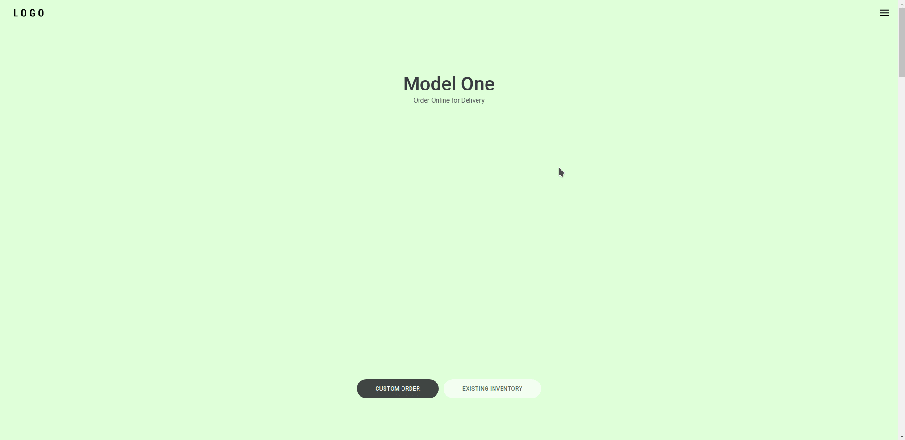

# <div align="center">Tesla UI Clone</div>


<p></p><br>
<p></p><br>

## 🛠️ Tecnologias

<ul>
  <li><a href="https://reactjs.org/">React</a></li>
  <li><a href="https://www.typescriptlang.org/">TypeScript</a></li>
</ul>

## ⚙️ Requisitos

<ul>
  <li><a href="https://git-scm.com/">Git</a></li>
  <li><a href="https://nodejs.org/en/">Node.js</a></li>
  <li><a href="https://www.npmjs.com/">NPM</a></li>
</ul>

## 🚀 Instalação

```
$ git clone https://github.com/jeffersonximeness/tesla-clone.git

$ npm install
$ npm start
```

## 💡 Observação
<div>
    <p>O objetivo do projeto é voltado ao estudo do comportamento da UI do site da Tesla.</p>
    <p>As fotos dos modelos de carros e logo não foram inseridas por questões de direitos autorais.</p>
</div>
<br>
<p>A aplicação irá abrir localmente em <strong>http://localhost:3000</strong></p>